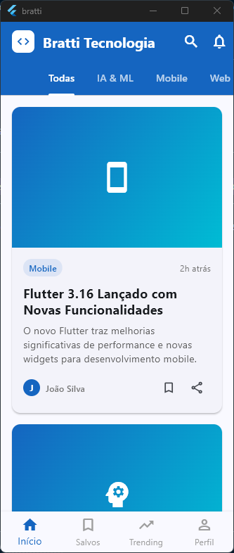

# 📱 Tech News App - Flutter

> Um aplicativo de notícias sobre tecnologia desenvolvido em Flutter com foco em boas práticas e arquitetura limpa.

[](https://flutter.dev)
[](https://dart.dev)

## 🎯 Sobre o Projeto

Este projeto foi desenvolvido como parte do meu portfólio para demonstrar competências em desenvolvimento mobile com Flutter. O aplicativo apresenta uma interface moderna e responsiva para consumo de notícias tecnológicas, implementando padrões de design e arquitetura profissionais.

## ✨ Features Implementadas

- 📰 **Listagem de notícias** - Exibição organizada de artigos por categoria
- 🔍 **Sistema de busca** - Pesquisa inteligente entre os artigos
- 🎨 **Interface responsiva** - Design adaptável para diferentes tamanhos de tela
- 📱 **Material Design 3** - Seguindo as diretrizes mais recentes do Google
- 🏗️ **Arquitetura organizada** - Separação clara de responsabilidades
- 🎯 **Navegação intuitiva** - Experiência de usuário fluida

## 🛠️ Tecnologias Utilizadas

- **Flutter 3.x** - Framework principal
- **Dart** - Linguagem de programação
- **Material Design 3** - Sistema de design
- **Cupertino Icons** - Conjunto de ícones

## 📁 Estrutura do Projeto

```
lib/
├── constants/          # Constantes da aplicação
│   ├── app_colors.dart
│   └── app_strings.dart
├── models/            # Modelos de dados
│   └── news_article.dart
├── screens/           # Telas da aplicação
│   ├── home_screen.dart
│   ├── article_detail_screen.dart
│   └── search_screen.dart
├── widgets/           # Componentes reutilizáveis
│   ├── category_tabs.dart
│   └── news_card.dart
├── services/          # Serviços e APIs
└── utils/            # Utilitários
```

## 🚀 Como Executar

### Pré-requisitos
- Flutter SDK 3.0+
- Dart SDK
- Android Studio / VS Code
- Emulador Android/iOS ou dispositivo físico

### Instalação
```bash
# Clone o repositório
git clone https://github.com/filipebratti/flutter-tech-news-app.git

# Acesse o diretório
cd flutter-tech-news-app

# Instale as dependências
flutter pub get

# Execute o aplicativo
flutter run
```

## 📱 Screenshots

<div align="center">
  
</div>

## 🎯 Objetivos de Aprendizado

Este projeto foi desenvolvido para demonstrar:

- ✅ **Desenvolvimento Mobile** - Criação de apps nativos multiplataforma
- ✅ **Flutter Framework** - Domínio das principais funcionalidades
- ✅ **Material Design** - Implementação de interfaces modernas
- ✅ **Arquitetura de Software** - Organização e estruturação de código
- ✅ **Boas Práticas** - Clean Code e padrões de desenvolvimento
- ✅ **Git/GitHub** - Controle de versão e documentação

## 🔄 Próximas Implementações

- [ ] Integração com API real de notícias
- [ ] Sistema de favoritos
- [ ] Modo escuro/claro
- [ ] Notificações push
- [ ] Testes unitários e de widget
- [ ] CI/CD pipeline

## 📈 Melhorias Técnicas Planejadas

- [ ] Implementação de State Management (Provider/Bloc)
- [ ] Persistência local (SQLite/Hive)
- [ ] Tratamento de erros robusto
- [ ] Loading states e skeleton screens
- [ ] Otimização de performance

## 👨‍💻 Desenvolvedor

**Filipe Bratti**
- 💼 [LinkedIn](https://www.linkedin.com/in/filipebratti/)
- 📧 filipebratti@hotmail.com
- 🌐 [Portfólio](https://github.com/filipebratti)

---

<div align="center">
  <sub>Desenvolvido com ❤️ por Filipe Bratti</sub>
</div>
